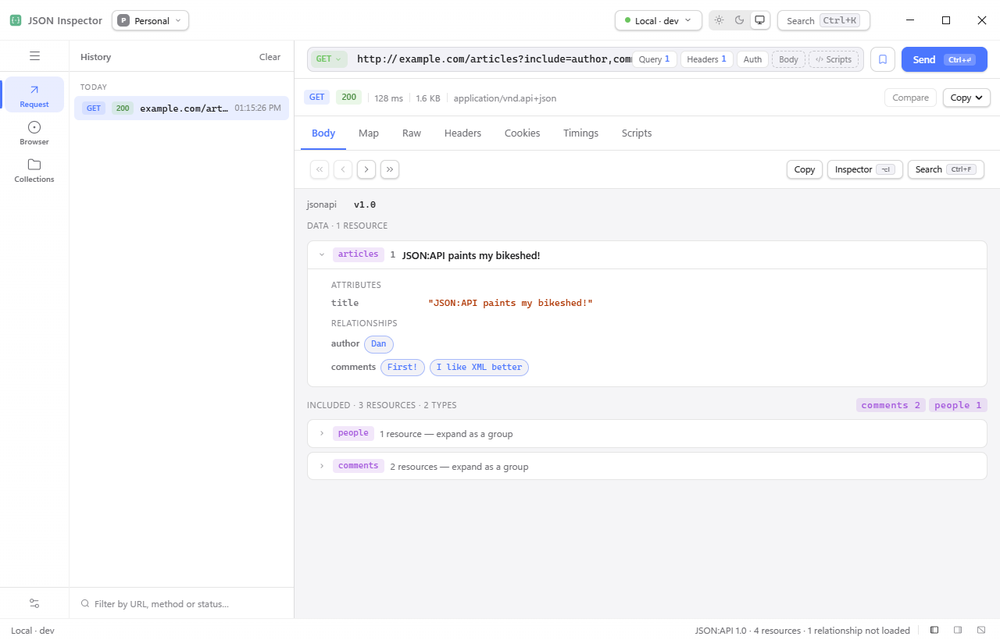

# JSON Inspector

A desktop HTTP client for macOS, Windows and Linux, with a browser extension that captures what a page
actually sends and a viewer that understands JSON:API.

Everything lives in a SQLite file on your machine: no account, no sync server, no telemetry. The app
talks to the network only for the requests you make and for the update check.

<picture>
  <source media="(prefers-color-scheme: dark)" srcset="docs/media/screenshot-dark.png">
  
</picture>

*A request from history, its response read as a graph: `articles` open with its attributes, and
`author` / `comments` link to the resources they point at.*

## Contents

- [What it does](#what-it-does)
- [Install](#install)
- [First run](#first-run)
- [The browser extension](#the-browser-extension)
- [Keyboard](#keyboard)
- [Where your data lives](#where-your-data-lives)
- [Build from source](#build-from-source)
- [Tests](#tests)
- [Releasing](#releasing)
- [Documentation](#documentation)
- [License](#license)

## What it does

It sends HTTP requests and shows what came back. Everything a desktop client in this family has is
here: a request line with query parameters, headers, a body and authorization as chips inside it;
collections of requests in a tree, run one by one or in sequence; environments with `{{variables}}` and
secrets; the whole history, searchable, each entry replayable as a draft.

Two things are less common:

- **Capture from the browser.** The Chrome extension in `extension/` hands over the requests the page
  in a selected tab is making — the real ones, with the real headers and bodies. A request you cannot
  reproduce by hand becomes one you can replay and edit.
- **JSON:API read as a graph.** A JSON:API answer is a graph: resources in `data`, more in `included`,
  stitched together by `relationships`. The viewer draws that graph instead of the wall of JSON.
  Clicking a relationship lands on the resource it points to, `links.related` opens one that is not in
  the document at all, and `self` / `next` / `prev` are followed as links rather than by editing the
  URL.

Responses and requests can be copied out in five formats — cURL, fetch, wget, HTTPie, PowerShell — so
what you built here can be used anywhere else.

## Install

Downloads are on the [Releases](https://github.com/Jurager/json-inspector/releases) page.

| Platform | File | Notes |
| --- | --- | --- |
| macOS 12+ | `json-inspector-darwin-universal.dmg` | Universal: Apple Silicon and Intel |
| Windows 10+ | `json-inspector-windows-amd64-installer.exe` | Per-user install, no administrator rights. Registers the `json-inspector://` scheme |
| Linux | `.deb` | Needs GTK4 and WebKitGTK 6.0 (Ubuntu 24.04+, Debian 13+). Installs a `.desktop` entry and registers the URL scheme |

The same builds are published as archives next to the installers: `…-darwin-{arm64,amd64}.app.zip`,
`…-windows-amd64.exe.zip`, `…-linux-amd64.tar.gz`. Those are what the built-in updater downloads — not
something to install by hand. macOS gets both architecture names for one universal build, or an Intel
machine would never find its update.

To update, use the rail menu or `Ctrl+U` / `⌘U`: the About window checks and offers the new version,
with what changed and the choice to skip it or be reminded later. Updates are verified by checksum, and
a macOS bundle by its code signature as well.

## First run

Type a URL into the request line and press **Send**. The chips in that line — Query, Headers, Auth,
Body, Scripts — open over the response without moving it.

With no server to talk to yet, pick **Load a sample** from the rail menu: it sends nothing and loads a
JSON:API document, so the tree, the relationships and the map have something to show.

The rail on the left switches between the three places requests come from: **Request** for what you type
here, **Browser** for what the extension captured, **Collections** for what you saved.

## The browser extension

It is loaded unpacked from this repository — it is not published to the Web Store.

1. Open `chrome://extensions` and turn on **Developer mode**.
2. Choose **Load unpacked** and select the `extension/` folder.
3. Open the tab you want to watch and start capturing it from the extension popup.

Captured requests appear under **Browser**, and the extension's link opens the app on the tab you were
looking at, through the `json-inspector://` scheme.

## Keyboard

| Keys | What it does |
| --- | --- |
| `Ctrl/⌘ K` | Search across collections, history, environments and settings |
| `Ctrl/⌘ E` | Environments and variables |
| `Ctrl/⌘ ↵` | Send the request |
| `Ctrl/⌘ F` | Search inside the response |
| `Ctrl/⌘ U` | Check for updates |

Shortcuts are bound to the physical key, not the letter, so they work the same on a non-Latin layout.

## Where your data lives

One SQLite file in your user configuration directory:

| Platform | Path |
| --- | --- |
| macOS | `~/Library/Application Support/json-inspector/app.db` |
| Windows | `%APPDATA%\json-inspector\app.db` |
| Linux | `~/.config/json-inspector/app.db` |

**Secrets are stored in that file as plain text.** It is a deliberate trade: the app works the same way
on every platform and depends on no keychain, and a password you can read in a file you own is better
than one you cannot recover at all. The file and its write-ahead log are created readable only by you,
and secret values are marked as such in the interface and kept out of logs.

One thing to know about that trade: a request you copy out — as cURL, fetch or any of the other formats
— carries the credential with it, because a request is copied whole. Copying one is a deliberate act,
and the secret goes wherever you paste it. Delete the database file and you have deleted everything.

## Build from source

Go, Node.js, the Wails 3 CLI and [Task](https://taskfile.dev):

```sh
go install github.com/wailsapp/wails/v3/cmd/wails3@v3.0.0-beta.22
go install github.com/go-task/task/v3/cmd/task@latest
```

The versions of `wails3`, of the Go module `github.com/wailsapp/wails/v3` and of `@wailsio/runtime` in
`frontend/package.json` have to match: the three speak one IPC protocol, and a mismatch shows itself as
a blank window rather than an error. `task verify` compares the Go and JS sides.

```sh
task dev       # the window, rebuilding as you edit; the dev server is on 9245
task build     # binary into bin/
task run       # run what was built
task package   # → dist/ for the current platform
```

`task --list` has the rest. Packaging only works on the platform it is for: DMG on macOS, the NSIS
installer on Windows (it needs `makensis`), the `.deb` on Linux.

**After changing a bound Go method, regenerate the bindings in the same change:**

```sh
wails3 generate bindings -clean=true -ts -i
```

Renaming or deleting one breaks the frontend at runtime, not at build time — calls go by numeric id,
and `vue-tsc` cannot see it.

## Tests

```sh
go vet ./... && go test ./...                  # includes archtest: layering and naming, as a test
cd frontend && npx vue-tsc --noEmit            # frontend types against the bindings
cd frontend && node scripts/check-messages.mjs # the two message catalogues agree
```

`internal/archtest` enforces the rules written down in [docs/ARCHITECTURE.md](docs/ARCHITECTURE.md):
which layer may import which, and that packages are named for what they provide. A violation fails
`go test`, so the architecture is a build gate rather than a convention.

## Releasing

Tag and push; GitHub Actions builds all three platforms, publishes the artefacts, adds
`checksums.txt` and writes the release.

```sh
git tag v1.0.0
git push origin v1.0.0
```

Write the release body by hand, one change per line, each starting with a list marker: the update
window shows it as "What's new", and a generated list of pull requests reads like noise there.

The version reaches the binary through `-ldflags -X json-inspector/internal/platform.version`, and the
build number through `…platform.build`. The app's name, bundle identifier, publisher and description are
declared once in `internal/platform/identity.go`, written into the files the packagers read
(`build/config.yml`, both `Info.plist` files, `info.json`, the Windows manifest, `nfpm.yaml`) by
`internal/tools/manifest`, and checked against Go by that tool's test.

## Documentation

- [docs/ARCHITECTURE.md](docs/ARCHITECTURE.md) — layers, the tree, how to add a feature, review checklist.
- [docs/FRONTEND.md](docs/FRONTEND.md) — where things live in the frontend, the primitives, the theme.
- [docs/RECOMENDATIONS.md](docs/RECOMENDATIONS.md) — the naming, import and test-double rules this project adds on top of Google's Go style guide.
- [design_handoff_json_inspector/](design_handoff_json_inspector/) — the design handoff, the source of truth for how the app looks.

## License

[MIT](LICENSE.md)
